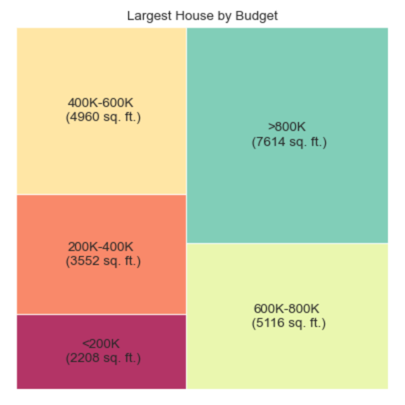

# dallas-house-prices
Scrapes housing market data from Zillow and some exploratory analysis.

## Tools
BeautifulSoup, Pandas, Matplotlib, Position Stack API, Geopandas, Seaborn.

## dallas-homes
Python script that loops through each page and saves the html content as a dictionary to be accessed by page number. To avoid crashing their server or causing any issues I kept this under 20 pages, yielding over 600 results.

Each listing was scraped for the following data:
* Address, city, state, zipcode
* Beds
* Baths
* Price 
* Type

## dallas-housing-market
Exploratory data analysis that looks at: 
* The distribution of housing prices in the Dallas area - with and without outliers.
* The number of houses available for each budget range.
* The largest house you can buy for each budget range.
* Zipcode and size by budget range. 
* Price per square foot by budget range. 
* Cost compared to size, separated by the number of bedrooms.
* Cost compared to size, separated by zipcode (this plot needs more data to get accurate information).

The data was run through different algorithms to determine the best model for predictions. Using the decision tree model, my plan is to create a tool that can predict price based on user input (size, number of bedrooms, location, etc.)  

## Future projects
* Past data or data in a few years to see how housing prices in Dallas have changed over time 
* Scrape nearby areas to compare inner city to suburban housing prices
* Scrape data from another city/state and compare 
* Add website that allows you to filter data based on input criteria

## Limitations 
* The website doesn't allow webscraping so I couldn't pull enough data 
* If you've been to Dallas you know there's a stark contrast between certain zipcodes. I'd like to add and group by neighborhood to get a better look at trends in certain areas. 

## Resources
Dallas shapefile from [Dallas City Hall website](https://gis.dallascityhall.com/shapefileDownload.aspx)
Zip code location data from [Position Stack API](https://positionstack.com/documentation)
